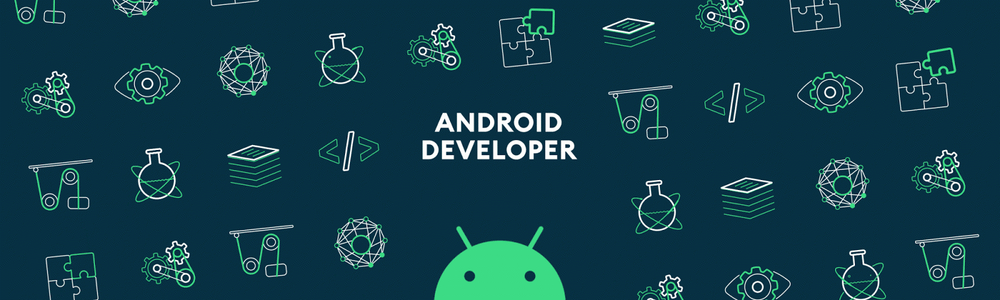

<h1 align="center">Hi 👋, I'm Nguyen Tuan Khoi</h1>
<h3 align="center">A passionate mobile developer from Vietnam</h3>

- 🔭 I’m currently working at [Executionlab](https://executionlab.asia/)

- 👨‍💻 All of my projects are available at [https://github.com/iawtk2302](https://github.com/iawtk2302)

- 💬 Ask me about **Flutter, Android**

- 📫 How to reach me **work.tuankhoi.2302@gmail.com**

- ⚡ Fun fact **I usually smile**

<h3 align="left">Connect with me:</h3>

<h3 align="left">Languages and Tools:</h3>

          

&nbsp;

