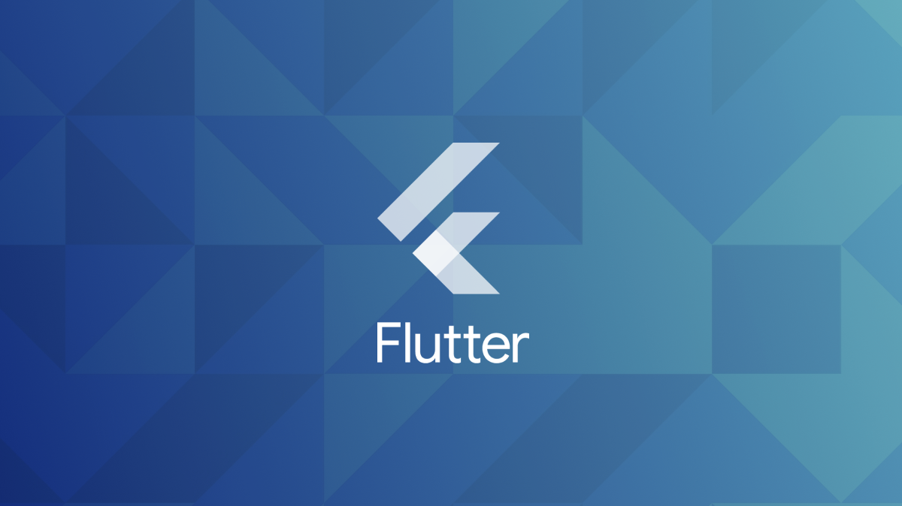
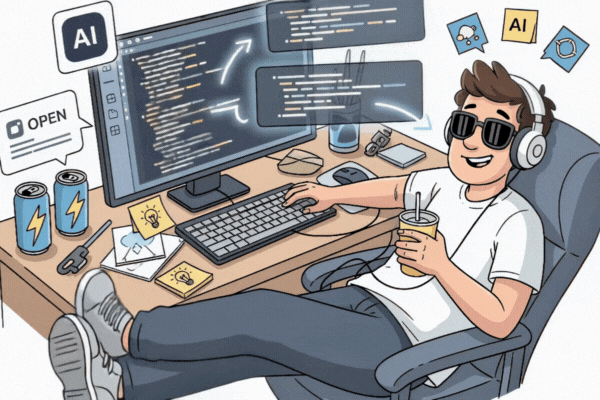

<!-- Header Banner -->
<div align="center">
  
  [](https://git.io/typing-svg)

  
  
</div>

---

## 🧑‍💻 About Me

```yaml
name: Nguyen Tuan Khoi
location: Ho Chi Minh City, Vietnam 🇻🇳
current_role: Mobile Developer @ Vietnam Silicon
education: B.E. in Software Engineering — UIT, VNU-HCM
experience: 2+ years in Mobile Development
portfolio: tuankhoidev.com
```



I'm a passionate **Mobile Developer** with **2+ years of experience** delivering high-quality cross-platform applications. I focus on **product quality**, **performance**, and **user experience**.

- 🏢 Currently at **[Vietnam Silicon](https://vnsilicon.net/)** — building cross-platform Flutter apps
- 📱 Specialized in **Flutter** & **Native Android** development
- 🔧 Experienced in **CI/CD** pipelines with GitHub Actions & Fastlane
- 📦 Open source contributor — maintaining Flutter plugins on [pub.dev](https://pub.dev/packages/easy_video_editor)
- 🎓 B.E. in Software Engineering at **UIT, VNU-HCM**
- 🌐 Portfolio: **[tuankhoidev.com](https://tuankhoidev.com/)**

<br clear="both"/>

---

## 💼 Experience

| Role | Company | Period |
|------|---------|--------|
| **Mobile Developer** | [Vietnam Silicon](https://vnsilicon.net/) | Dec 2025 - Present |
| **Full-Stack Mobile Developer** | [003lab](https://003lab.com/) *(Remote)* | Jun 2025 - Nov 2025 |
| **Mobile Developer** | [ExecutionLab](https://executionlab.asia/) | Mar 2023 - Nov 2025 |
| **Mobile Developer Intern** | [LECLE Vietnam](https://lecle.co.kr/) | Nov 2022 - Jan 2023 |

---

## 🚀 Featured Projects

<table>
  <tr>
    <td align="center" width="33%">
      <h3>🗣️ Viet Speak</h3>
      <p>AI-powered app helping foreigners learn Vietnamese through local landmarks and travel experiences</p>
      <a href="https://apps.apple.com/vn/app/viet-speak/id6754000867"></a>
      <a href="https://play.google.com/store/apps/details?id=com.lab003.vietspeak"></a>
    </td>
    <td align="center" width="33%">
      <h3>💬 Gimic SNS</h3>
      <p>Communication & task management platform for clinics with real-time messaging and team collaboration</p>
      <a href="https://apps.apple.com/jp/app/%E3%83%89%E3%82%AF%E3%82%BF%E3%83%BC%E3%82%BA-%E3%83%95%E3%82%A1%E3%82%A4%E3%83%AB-%E3%83%A1%E3%83%87%E3%82%A3%E3%83%91%E3%82%B7%E3%83%BC-medipathy/id1668323663"></a>
      <a href="https://play.google.com/store/apps/details?id=jp.doctorsfile.medipathy"></a>
    </td>
    <td align="center" width="33%">
      <h3>🎬 Easy Video Editor</h3>
      <p>Lightweight Flutter plugin for video editing with <strong>7,000+ downloads</strong>. Trim, merge & compress</p>
      <a href="https://pub.dev/packages/easy_video_editor"></a>
    </td>
  </tr>
</table>

> 📂 See all my projects at **[tuankhoidev.com/projects](https://tuankhoidev.com/projects)**

---

## 🛠️ Tech Stack

<div align="center">

### 📱 Mobile & Frameworks


### 🧠 State Management


### 🌐 Languages


### ☁️ Backend & Database


### 🏗️ Architecture & Patterns


### ⚙️ DevOps & Tools


</div>

---

## 💬 What People Say

> *"Khôi has a truly sharp mind, learns remarkably fast, and is always open to acquiring new knowledge. His completion rate has been 100%."*
> — **Trong Nghia Bui**, Mobile Developer at PPAC Solutions

> *"His ability to write clean, maintainable, and efficient code makes him a valuable asset. One of his greatest strengths is his problem-solving mindset."*
> — **Vi Duc**, Mobile Developer at LECLE Vietnam

> *"He demonstrated a strong understanding of Flutter concepts and was able to quickly grasp new technologies."*
> — **Nguyen Tien Vi**, Software Engineer at Zalo

---

## 🤝 Connect with Me

<div align="center">
  
  [](https://tuankhoidev.com/)
  [](https://linkedin.com/in/khoihaycuoi)
  [](mailto:work.tuankhoi.2302@gmail.com)
  [](https://github.com/iawtk2302)

</div>

---

<div align="center">
  
  ### 💬 *"Code is like humor. When you have to explain it, it's bad."* — Cory House
  
  <br/>
  
  ⭐ **If you find my work helpful, consider giving a star!** ⭐
  
  

</div>
